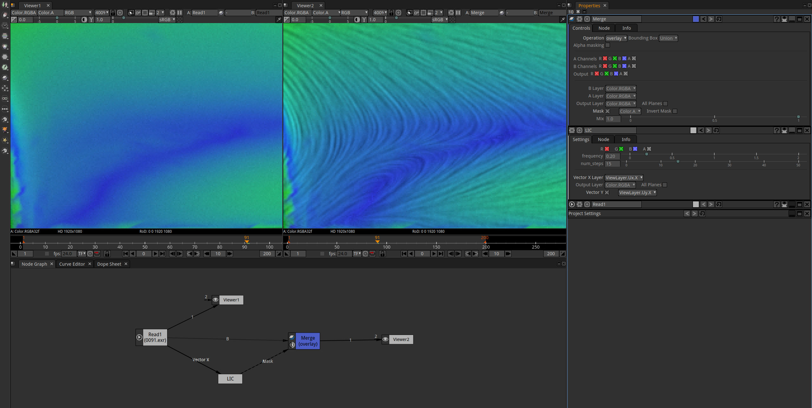
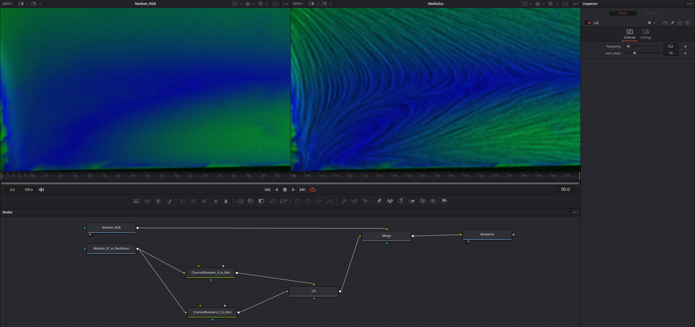

# Line Integral Convolution effect for OpenFX

*Disclaimer: This is just a proof-of-concept at the moment.*

[Line Integral Convolution (LIC)](https://en.wikipedia.org/wiki/Line_integral_convolution) is a visualization technique
for vector fields. It uses a noise texture warped by the vector field to show its structure. It is commonly found
in specialized CFD simulation and post-processing software.

This implementation of LIC is an [OpenFX plug-in](http://openeffects.org/), which brings this kind of visualization
into compositing software such as [Nuke](https://www.foundry.com/products/nuke-family/nuke),
[Natron](https://natrongithub.github.io/),
[Fusion (DaVinci Resolve)](https://www.blackmagicdesign.com/products/davinciresolve/fusion) and others.

## How to use the effect

1. You will need image with screen-space X, Y vectors - presumably in EXR format.
    - Magnitude of the vectors is not important, the effect will normalize them.
    - Pixels where X or Y is NaN or X = Y = 0 are excluded and will be made transparent black in the output.
2. Download `lic.ofx.bundle` from [GitHub releases page](https://github.com/tkarabela/blender-ensight-reader/releases/),
   or build it yourself (`lic` target in CMake, then create the bundle directory structure manually).
3. Install the plug-in:
    - On Windows, put the `lic.ofx.bundle` directory into `C:\Program Files\Common Files\OFX\Plugins`
    - On Linux, put the `lic.ofx.bundle` directory into `/usr/OFX/Plugins`
    - For more information, see ['Packaging OFX Plug-ins' in OpenFX docs](https://openfx.readthedocs.io/en/doc/Reference/ofxPackaging.html#installation-location)
4. Now you can use the plug-in, see below for instructions. 

### LIC effect in Natron

- In Natron, the usage is straightforward.
- Add the LIC effect node (located in menu: `LIC > LIC`)
- Connect both inputs ("Vector X", "Vector Y") to your EXR node.
- In properties of the LIC node, select appropriate source layers for "Vector X" and "Vector Y".
- For display it's suitable to Merge the LIC output with your beauty pass using blend mode "overlay"
  and using the alpha channel from LIC as mask.

### LIC effect in DaVinci Resolve / Fusion

- In Fusion, some wrangling with the layers is necessary.
- I was able to make it work in DaVinci Resolve 17.4.6 with the following node graph:
    - One MediaIn node with RGB layers (beauty pass RGB from EXR)
    - Another MediaIn, where Red layer is read from X vectors and Green layer is read from Y vectors
      in the EXR file.
    - Two Channel Boolean nodes that shuffle the X/Y vector layer into Red layer (come to think of it,
      you only need one for the Y vectors, the X vectors can be read from the MediaIn).
    - LIC effect node (located in menu: `LIC > LIC`) that is connected to the Channel Boolean nodes.
    - A Merge node with "overlay" blend mode for displaying.

## License

The LIC effect itself (source code located in `./src` directory) is licensed under MIT License,
see [LICENSE.txt](./LICENSE.txt).

Dependencies of the code are licensed as follows:

- The SimplexNoise C++ libary by Sebastien Rombauts is licensed under MIT License,
  see [SimplexNoise/LICENSE.txt](./SimplexNoise/LICENSE.txt).
- The OpenFX support C++ library and examples from The Open Effects Association Ltd.
  are licensed under 3-clause BSD License, see [openfx/Support/LICENSE](./openfx/Support/LICENSE).
